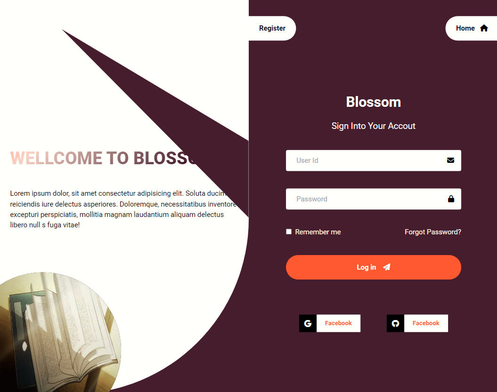

 # Vite-React-Redux Authentication Boilerplate

Welcome to the Vite-React-Redux Authentication Boilerplate! 🚀 This boilerplate provides a solid foundation for building React applications with Vite, Redux, and a robust authentication flow.

## Features

- **React & Redux Integration:** Powerful frontend development with React for user interfaces and Redux for state management.
- **Vite Build System:** Lightning-fast development and efficient builds with Vite.
- **Authentication Flow:** Robust authentication flow for secure user interactions.
  
##Screenshots


## Getting Started
Follow these steps to get started with the boilerplate:

1. **Clone the Repository:**
   ```bash
   git clone https://github.com/mkmahmud/Vite-Starter-redux-auth-tailwind.git

   cd your-boilerplate
   npm install

   npm run dev
  
## Contributing
If you'd like to contribute, please follow these steps:

1. Fork the repository.
2. Create a new branch for your feature or bug fix.
3. Make your changes and submit a pull request.
